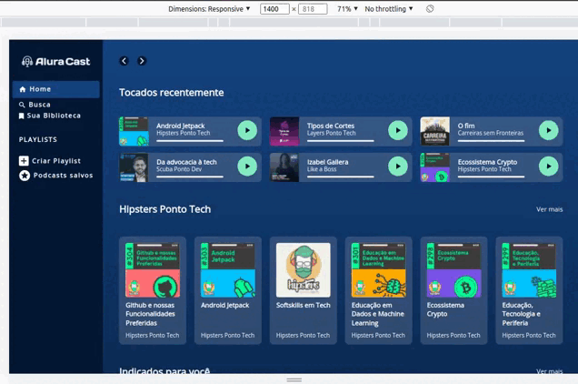

# Alura Cast

Desenvolvimento de uma aplicação frontend chamada Alura Cast. Tendo como principal objetivo desenvolver habilidades com Grid Layout.




## Funcionalidades

- Responsividade para: 1728px / 1024px / 428px
- Menu
- Tópicos: Tocados recentemente | Hipsters Ponto Tech | Indicados para você | Dev sem Fronteiras    

## Como utilizar

```bash
# Terminal

git clone https://github.com/MateusMaciel340/aluracast # clone do repositório

cd aluracast/ # acessando pasta

# acessar Live Server com index.html
```

## Contribuição

Contribuições são bem-vindas! Se você quiser contribuir com este projeto, por favor, abra uma issue para discutir suas ideias ou envie um pull request com suas alterações.

**Desenvolvedor:** Mateus Maciel - @mateusdev340

## Tecnologias:

- HTML
- CSS
- Grid Layout

## Licença

Este projeto é licenciado sob a licença Alura Cursos